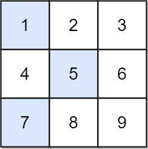
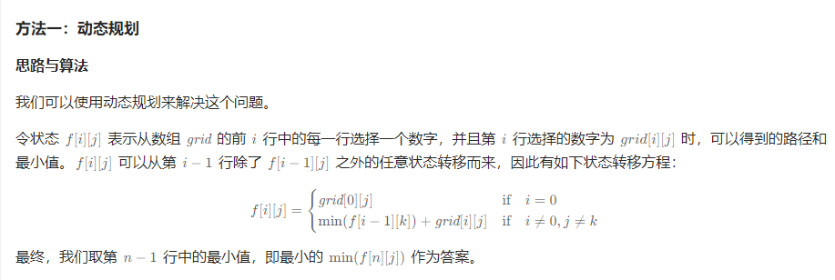
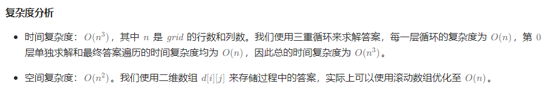
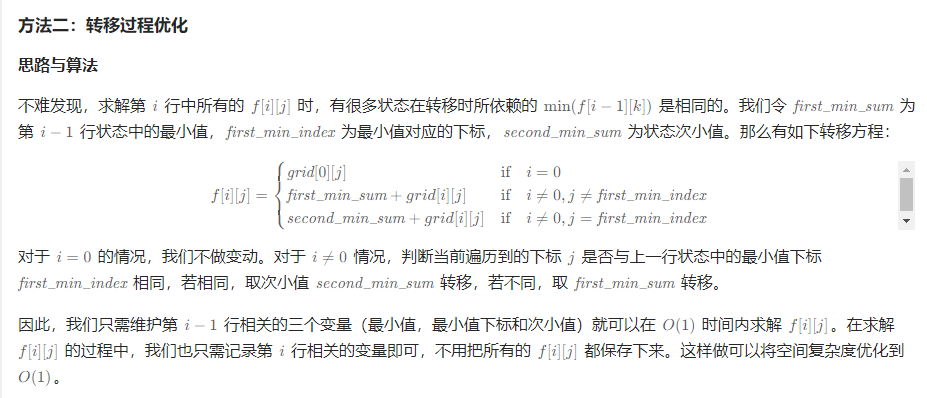

# 1289. 下降路径最小和 II

给你一个 n x n 整数矩阵 grid ，请你返回 非零偏移下降路径 数字和的最小值。
非零偏移下降路径 定义为：从 grid 数组中的每一行选择一个数字，且按顺序选出来的数字中，相邻数字不在原数组的同一列。

## 示例 1：


```
输入：grid = [[1,2,3],[4,5,6],[7,8,9]]
输出：13
解释：
所有非零偏移下降路径包括：
[1,5,9], [1,5,7], [1,6,7], [1,6,8],
[2,4,8], [2,4,9], [2,6,7], [2,6,8],
[3,4,8], [3,4,9], [3,5,7], [3,5,9]
下降路径中数字和最小的是 [1,5,7] ，所以答案是 13 。
```

```C
const int INF = 0x3f3f3f3f;

int minFallingPathSum(int** grid, int gridSize, int* gridColSize){
    int n = gridSize;
    int d[n][n];
    memset(d, 0x3f, sizeof(d));
    for (int i = 0; i < n; i++) {
        d[0][i] = grid[0][i];
    }
    for (int i = 1; i < n; i++) {
        for (int j = 0; j < n; j++) {
            for (int k = 0; k < n; k++) {
                if (j == k) {
                    continue;
                }
                d[i][j] = fmin(d[i][j], d[i - 1][k] + grid[i][j]);
            }
        }
    }
    int res = INT_MAX;
    for (int j = 0; j < n; j++) {
        res = fmin(res, d[n - 1][j]);
    }
    return res;
}
```


```C
int minFallingPathSum(int** grid, int gridSize, int* gridColSize) {
    int first_min_sum = 0;
    int second_min_sum = 0;
    int first_min_index = -1;
    
    for (int i = 0; i < gridSize; i++) {
        int cur_first_min_sum = INT_MAX;
        int cur_second_min_sum = INT_MAX;
        int cur_first_min_index = -1;
        for (int j = 0; j < gridSize; j++) {
            int cur_sum = (j != first_min_index ? first_min_sum : second_min_sum) + grid[i][j];
            if (cur_sum < cur_first_min_sum) {
                cur_second_min_sum = cur_first_min_sum;
                cur_first_min_sum = cur_sum;
                cur_first_min_index = j;
            } else if (cur_sum < cur_second_min_sum) {
                cur_second_min_sum = cur_sum;
            }
        }
        first_min_sum = cur_first_min_sum;
        second_min_sum = cur_second_min_sum;
        first_min_index = cur_first_min_index;
    }
    return first_min_sum;
}
```

