# 简介
## 计算机系统层次结构
语言|机器|描述
--|--|--
高级语言|虚拟机器M3|编译程序翻译成汇编语言程序
汇编语言|虚拟机器M2|汇编程序翻译成机械语言程序
操作系统|虚拟机器|机器语言解释操作系统
机械语言|实际机器M1|微指令解释机器指令
微指令系统|微程序机器M0|硬件直接执行微指令
# 计算机的基本组成
## 冯诺依曼计算机特点
1. 计算机由五大部分组成：运算器、控制器、存储器、输入输出设备
2. 指令和数据以同等地位存放于存储器，可按地址寻访
3. 指令和数据用二进制表示
4. 指令由操作码和地址码构成，操作码表示进行何种操作，地址码表示在哪里进行操作
5. ```存储程序```，程序存放于存储器内
6. 以运算器为中心图例中实线表数据流，虚线表控制流
   
   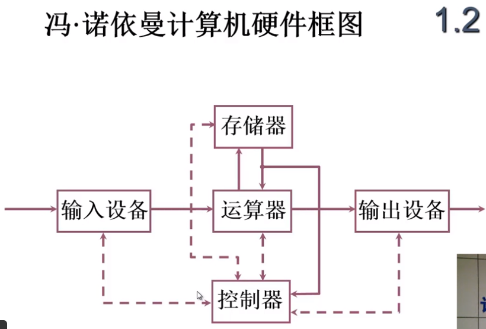
7. 以运算器为中心，运算器会非常繁忙
## 现代计算机系统硬件框图
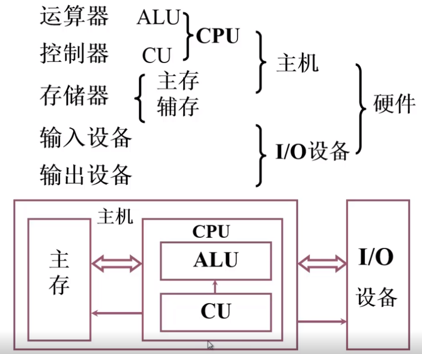
## 存储器
- 存储器基本结构：存储器、MAR、MDR
- 存储单元：存放一串二进制代码
- 存储字：存储单元中二进制代码的组合
- 存储字长：存储单元中二进制代码的位数
- 每个存储单元赋予一个地址，每个存储单元内存放在一个存储字
- 存储单元构成了存储体
- MAR：存储器地址寄存器，可以反映存储单元个数
- MDR：存储器数据寄存器，可以反映存储字长
## 运算器
- 构成：ALU(运算器)、ACC(累加寄存器)、MQ(乘商寄存器)、X(数据寄存器)

### 运算时各寄存器作用

操作|ACC|MQ|X
--|--|--|--
加法|被加数||加数
加法结果|和||
减法|被减数||减数
减法结果|差||
乘法||乘数|被乘数
乘法结果|乘积高位|乘积低位|
除法|被除数||除数
除法结果|余数|商|

## 控制器
### 控制器功能
1. 解释指令
2. 保证指令按序执行

### 完成一条指令
1. 取指令：PC(程序计数器),存放当前预执行指令地址，具有计数功能
2. 分析指令：IR(指令寄存器),存放当前预执行指令
3. 执行指令:CU(控制器)
CU、PC、IR构成了控制器

## 指令实例
取数指令
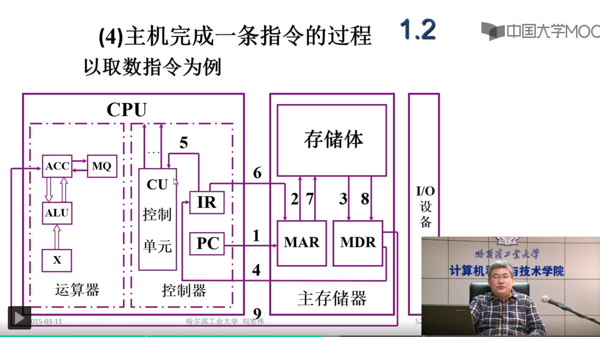
存数指令
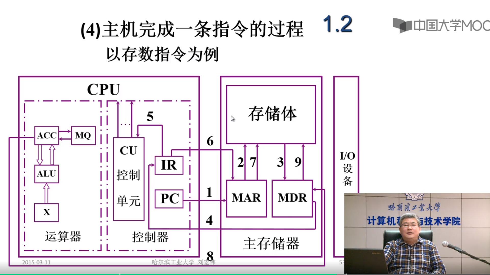

# 系统总线
## 基本概念

- 串行总线一次传一位信号，适合远距离传输
- 并行总线一次传多位信号，长距离容易信号干扰

## 总线分类
1. 片内总线：芯片内部的总线
2. 系统总线：计算机各部件之间 的信息传输线
   1. 数据总线：双向 与机器字长、存储字长有关
   2. 地址总线：单向 与存储地址、 I/O地址有关
   3. 控制总线：有出 有入
3. 通信总线：用于 计算机系统之间 或 计算机系统与其他系统（如控制仪表、移动通信等）之间的通信
   1. 串行
   2. 并行

## 总线判优控制
### 基本概念
- 主设备(模块):对总线有控制权
- 从设备(模块):响应主设备发来的总线请求

### 分类
1. 集中式
   1. 链式查询
   2. 计数器定时查询
   3. 独立请求方式
2. 分布式

### 链式查询
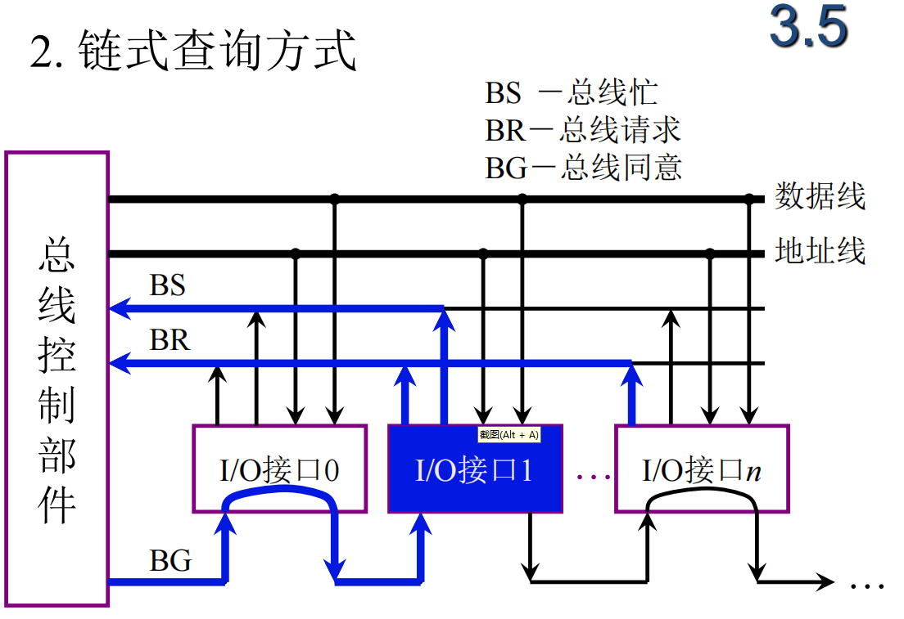
链式查询是指BG线判定优先级时链式查询

### 计数器定时查询
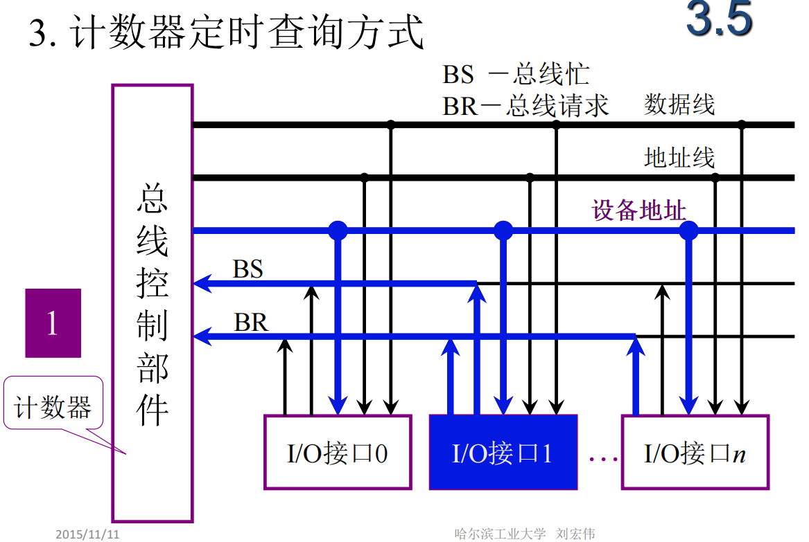
优先级通过计数器递增查询，计数器初值可随需求定

### 独立请求
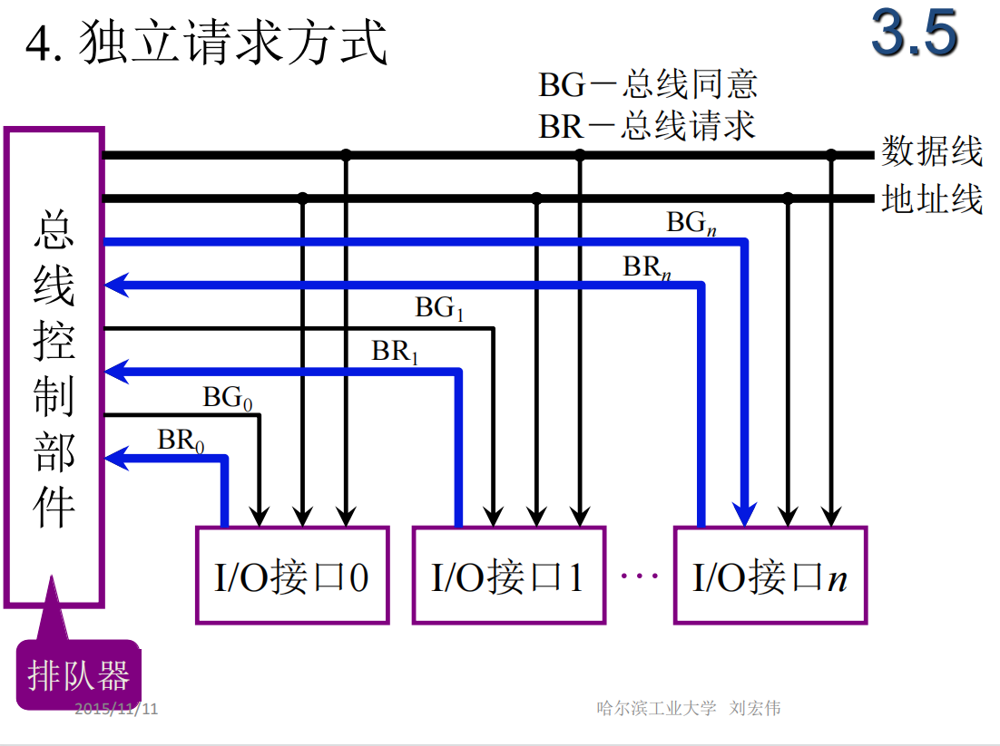

## 总线通信控制
### 总线传输周期
1. 申请分配阶段：主模块申请，主线判优控制
2. 寻址阶段：主模块向从模块给出地址和命令
3. 传输阶段：主从模块交换数据
4. 结束阶段：主模块撤销相关信息
---------------
总线通信四种方式：

1. 同步通信：由统一时标控制数据传送
2. 异步通信：采用应答方式，没有公共时钟标准
3. 半同步通信：引入wait信号，同步、异步结合
4. 分离式通信：充分挖掘系统总线每个瞬间的潜力
### 同步通信
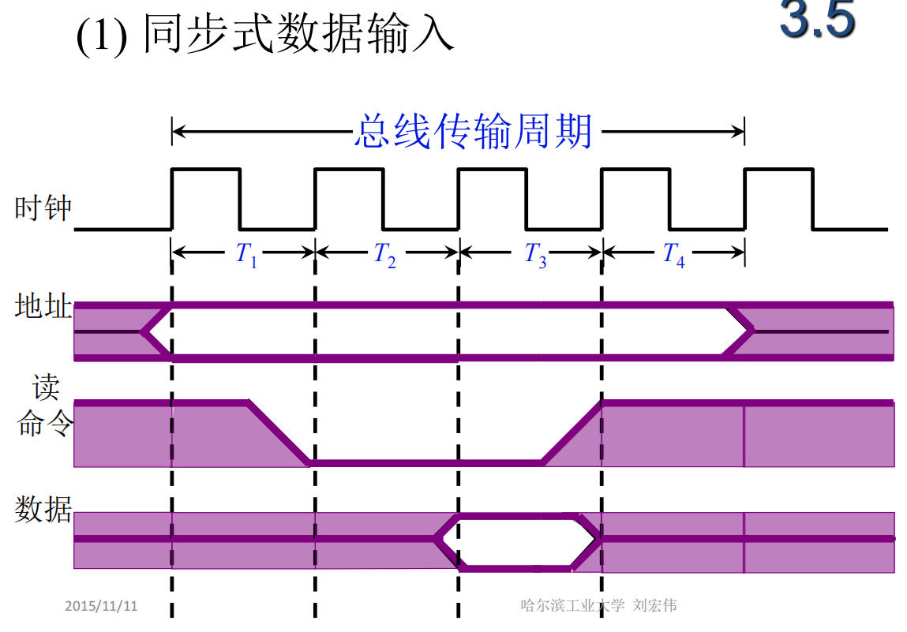

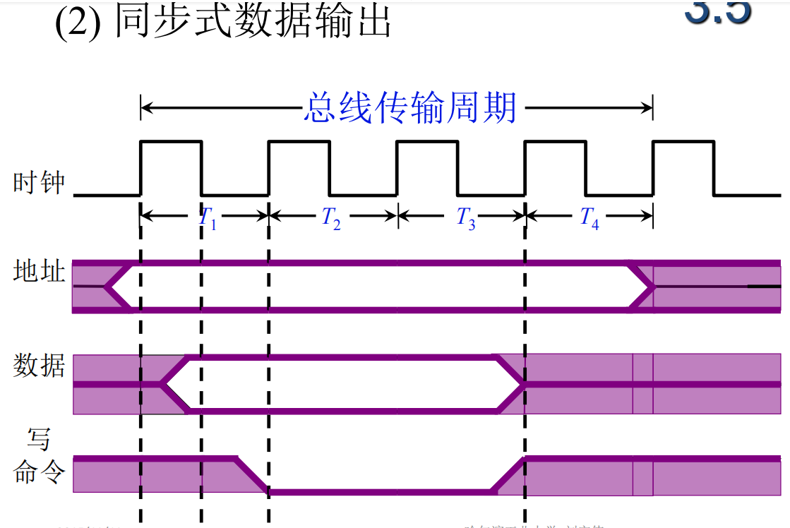
### 异步通信
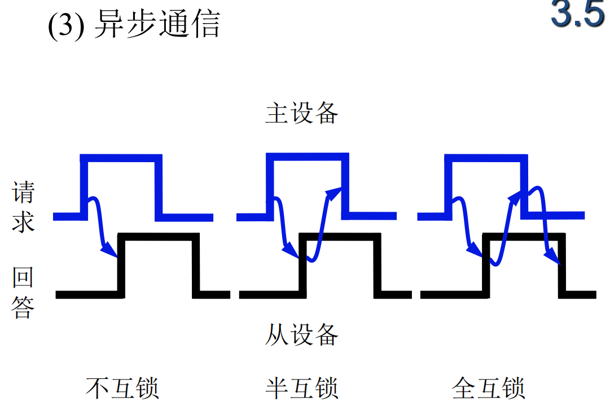
### 半同步通信
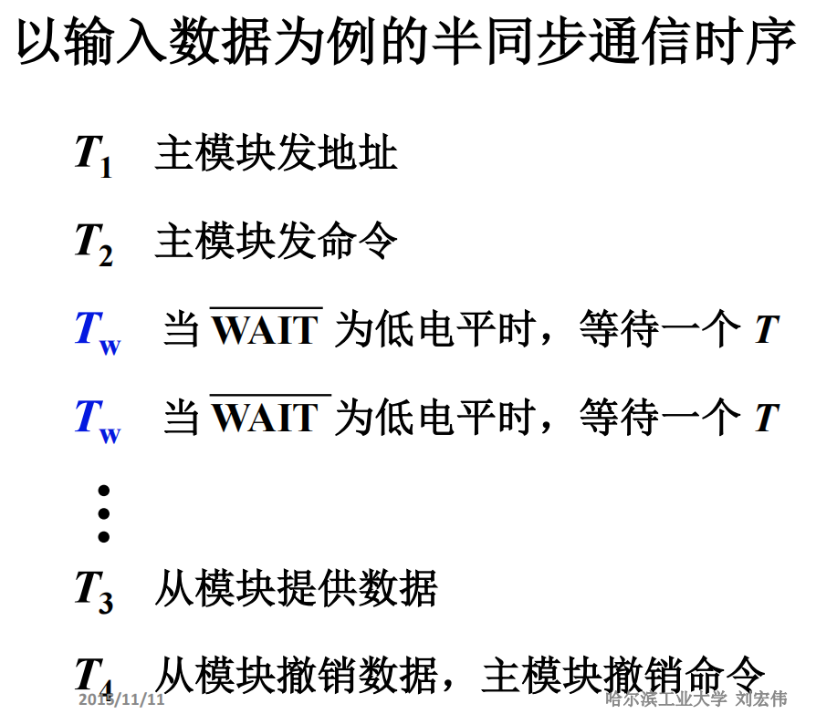

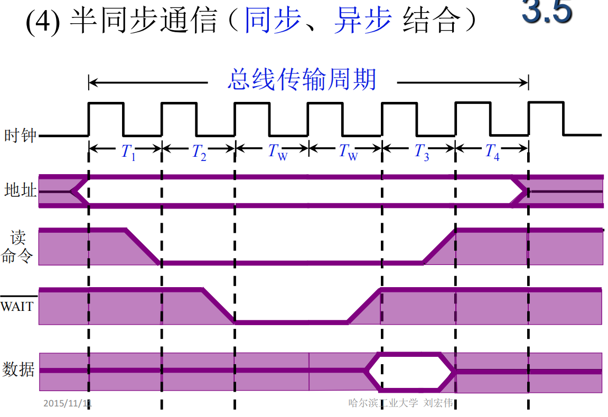

### 分离式通信
- 以上三种方式在从模块准备数据时，总线会出现被占用但空闲的状态，为了解决问题，引入分离式通信
- 将一个传输周期分为两个子周期
   1. 主模块申请占用主线，使用后放弃主线使用权
   2. 从模块申请占用主线，通过主线传输数据
- 分离式通信特点
   1. 各模块有权申请占用总线
   2. 采用同步方式通信，不等对方回答
   3. 各模块准备数据时，不占用总线
   4. 总线被占用时，无空闲

# 主存储器
## 主存和CPU的关系

- MDR寄存器通过数据总线(双向)与主存相连
- MAR寄存器通过地址总线(单向，指向主存)与主存相连
- CPU与主存存在控制总线(读、写)

## 主存中存储单元地址的分配

- 大端存储高位字节存储在低地址(适合人看),小端反之
- 设地址线24根,按字节寻址,2的24次方 = 16 MB
- 若字长为16位,按字寻址,8 MW
  
  [视频](https://www.bilibili.com/video/BV1P54y1b7wf/?spm_id_from=333.337.search-card.all.click&vd_source=a01a4ab2c5f132460b007d3996d24a28)
  
  [文档](https://blog.csdn.net/qq_33499861/article/details/80303174?utm_medium=distribute.pc_relevant_t0.none-task-blog-2%7Edefault%7EBlogCommendFromMachineLearnPai2%7Edefault-1.essearch_pc_relevant&depth_1-utm_source=distribute.pc_relevant_t0.none-task-blog-2%7Edefault%7EBlogCommendFromMachineLearnPai2%7Edefault-1.essearch_pc_relevant)

## 半导体存储芯片

### 结构
- 芯片内包括存储矩阵、译码驱动和读写电路
- 译码驱动与地址线(单向，指向芯片)和片选线(单向，指向芯片)相连
- 读写电路与数据线(双向)和读、写控制线(单向，指向芯片)相连
- 举例，若地址线10，数据线4，芯片容量为：2的10次方乘4位 = 1K*4位
- 举例用 16K × 1位 的存储芯片组成 64K × 8位 的存储器
   1. 8片16K*1组成一片16K×8
   2. 4片16K×8组成64K乘8
   3. 总共需要32片
   4. 片选线用于选择4大片

### 半导体存储芯片的译码驱动方式
#### 线选法
- 根据地址线选择对应的存储单元，类似于一维坐标定位
- 问题，现在地址线太多，采用线选法不好集成
#### 重合法
- 采用X地址译码器和Y地址译码器，类似于x,y轴二维坐标定位

## 随机存取存储器

### 静态RAM(SRAM)
- 保存0、1原理采用双稳态触发器
### 动态RAM(DRAM)
- 保存0、1原理采用电容器
- 动态RAM刷新的原因是电容可能漏电
- 动态RAM刷新与行地址有关，一刷新刷新一行
   1. 集中刷新：固定周期时间进行集中刷新，集中刷新存在死区，死区时间内DRAM只能用于刷新，CPU和IO设备无法对DRAM进行读写操作
   2. 分散刷新：将每行刷新周期放于读写周期后，刷新过于频繁，延长了存取周期，芯片性能下降
   3. 异步刷新：集中刷新和分散刷新结合，大用分散，每个小部分用集中，将刷新阶段安排与指令译码阶段，可避免死区
## 只读存储器
- MROM
- PROM：一次性编程
- EPROM：多次性编程，紫外线擦除比较麻烦
- EEPROM：电可擦写，局部、全局擦写
- Flash Memory：闪速型存储器

## 存储器扩展
- 位扩展可看做并联，扩展数据线，同时读写，同时被片选
- 字扩展可看做串联，扩展地址线

## 存储器校验
- 任意两组合法代码之间最小位数差异是编码的最小距离
- 编码纠错、检错能力与编码的最小距离有关
- L-1=D+C；L是编码的最小距离，D是检测错误位数，C是纠错错误位数；D>=C

### 汉明码
[汉明码1视频](https://www.bilibili.com/video/BV1WK411N7kz/?spm_id_from=333.337.search-card.all.click)

[汉明码2视频](https://www.bilibili.com/video/BV1pV411y7E8/?spm_id_from=333.788.recommend_more_video.-1)

- 汉明码采用奇偶校验
- 汉明码采用分组校验
- 汉明码的分组是一种非划分方式
- 汉明码一位纠错
- 汉明码二分思想
- 汉明码分组方式:第一组:XX1;第二组:X1X;第三组:1XX。如011,表示为一二组重合部分
- 每小组校验位与数据位整体偶检验后(异或操作，1个数为偶数时为0)，由高到低组合为出错位二进制表示的位置，000表未出错(除了0位，0为不确定，可不放数据位，放置整体校验位)
- 校验位放于2的整数次方的位置
- 2的k次方>=n+k+1;n是数据位数量,k是检验位数量
- 检验位取值,各小组数据位1偶数个为0,奇数个为1(偶校验)，也可以奇校验

## 提高访存速度措施
- 采用高速器件
   1. SDRAM(同步DRAM)：在系统时钟控制下进行读出和写入，CPU无须等待
   2. RDRAM
   3. 带Cache的DRAM：DRAM内集成由SRAM组成的Cache
- 采用层次结构 Cache-主存
- 调整主存结构
   1. 单体多字系统：增加存储器带宽，存在单字写入有问题，非连续地址有问题
   2. 多体并行：高位交叉：适用于片选，应用与增加存储器带宽会出现连续地址使单个存储器繁忙，其他存储器空闲的情况
   3. 多体并行：低位交叉：适用于增加存储器带宽，此处可引出流水线操作

## 高速缓冲存储器(Cache)
- 主存和缓存按块存储，块的大小相同，块内地址相同
- 用标记记录某缓存块对应的主存块号
- 命中率与Cache的容量和块长有关，容量越大越好，块长应适中
- Cache写操作要保证Cache与主存一致性
   1. 写直达法：写操作同时写入Cache和主存(写操作就是访问主存的时间)
   2. 写回法：写操作只写入Cache，当Cache替换回去时再写入主存(写操作就是访问Cache的时间)
- Cache改进
   1. 增加Cache级数
   2. 统一缓存和分立缓存:指令Cache和数据Cache
- Cache与主存地址映射
   1. 直接映射：每个缓存块对应若干主存块，每个主存块对应一个缓存块，Cache利用率可能低
   2. 全相联映射：比较的数量较多
   3. 组相联映射：结合直接映射和全相联映射
- 替换算法
   1. 先进先出(FIFO)
   2. 最近最少使用(LRU)

# IO
## IO与主机传递方式
- 程序查询方式：CPU和IO串行工作
- 程序中断方式：CPU和IO部分的并行工作
- DMA方式：利用硬件，CPU和IO并行工作
  - 周期窃取(周期挪用):DMA数据传输时会用到系统总线，此时CPU让出系统总线控制权，时间为一个存储周期
  - 与中断相比，不需要保护现场、恢复现场、执行中断程序
- 通道方式、IO处理机方式(没讲)